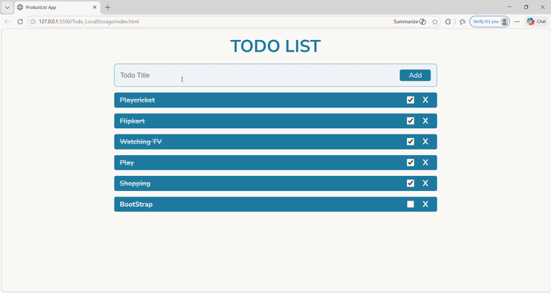
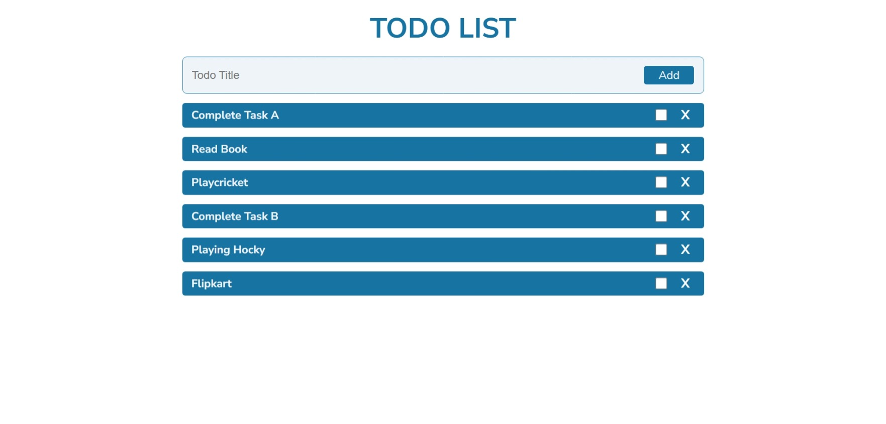
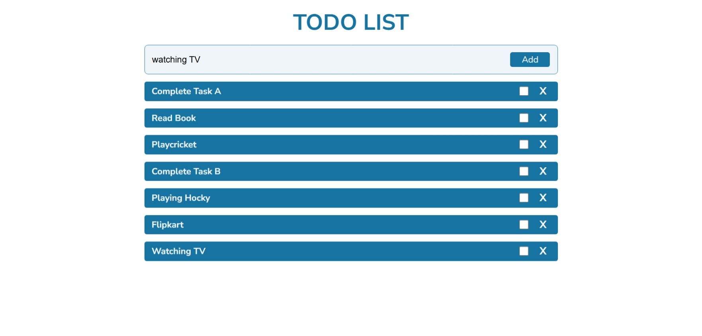
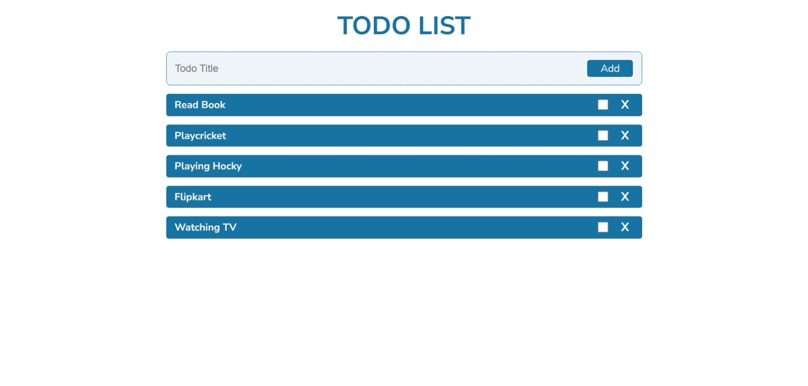

# 📝 JavaScript Todo App (LocalStorage)


A simple yet powerful **Todo Application** built using **Vanilla JavaScript**, allowing users to manage tasks efficiently with persistent storage using the browser's **LocalStorage API**.

---

## 🚀 Live Demo

🌐 **Live App:** https://khushi-66.github.io/javascript-todo-localstorage/

📂 **GitHub Repository:** https://github.com/khushi-66/javascript-todo-localstorage

---

## 🎥 Live Preview



---

## 📌 Overview

This project demonstrates core JavaScript concepts including **DOM manipulation**, **event handling**, and **persistent data management** without using any frameworks.

It highlights:

* Dynamic UI updates using JavaScript
* Managing application state manually
* Persistent data storage using LocalStorage
* Clean and responsive UI design

---

## 🧠 Key Learnings

* Manipulating DOM elements dynamically
* Handling user interactions and events
* Managing application state without React
* Using LocalStorage for persistent data
* Writing clean, structured, and maintainable JavaScript code

---

## 📸 Screenshots

### 🏠 Main Interface



### ✅ Task Management

### Add Todo



### Remove Todo



### 💾 Data Persistence (LocalStorage)


### 📱 Mobile View


---

## ✨ Features

* ➕ Add new tasks
* ❌ Delete tasks
* ✔️ Mark tasks as completed
* 💾 Persistent storage using LocalStorage
* ⚡ Instant UI updates
* 📱 Fully responsive design

---

## ⚡ Performance & Optimization

* Lightweight application (no external libraries)
* Fast DOM updates for smooth interaction
* Efficient LocalStorage usage for quick data retrieval
* Minimal and clean codebase

---

## 🛠️ Tech Stack

| Technology            | Usage            |
| --------------------- | ---------------- |
| **HTML5**             | Structure        |
| **CSS3**              | Styling          |
| **JavaScript (ES6+)** | Logic            |
| **LocalStorage API**  | Data persistence |

---

## 🌐 Deployment

This project is deployed using **GitHub Pages**, making it publicly accessible worldwide.

### 🚀 Deployment Process:

* Uploaded project to GitHub repository
* Enabled GitHub Pages in repository settings
* Selected main branch for deployment
* Generated live URL for public access

---

## 📂 Project Structure

```bash id="l0k9j8"
javascript-todo-localstorage/
│── index.html
│── style.css
│── script.js
│── screenshots/
│── assets/
│── README.md
```

---

## ⚙️ Installation & Setup

```bash id="p4o5i6"
git clone https://github.com/khushi-66/javascript-todo-localstorage.git
cd javascript-todo-localstorage
```

Open `index.html` in your browser 🚀

---

## 📈 Future Improvements

* ✏️ Edit task functionality
* 🔍 Search & filter tasks
* 🌙 Dark mode support
* 📅 Add due dates & reminders
* 📊 Task categories

---

## 👩‍💻 Author

**Khushi Sahu**
🔗 https://github.com/khushi-66

---

## ⭐ Support

If you like this project, give it a ⭐ on GitHub!
